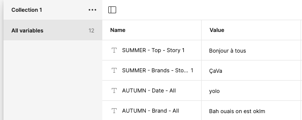

<!-- Improved compatibility of back to top link: See: https://github.com/othneildrew/Best-README-Template/pull/73 -->

<a name="readme-top"></a>

[![LinkedIn][linkedin-shield]][linkedin-url]

<!-- PROJECT LOGO -->
<br />
<div align="center">

<h3 align="center" id="readme-top">Frame-work.app Frontend</h3>

</div>

<!-- GETTING STARTED -->

## Getting Started

Before everything you have to create a .env file.

```
VITE_FIGMATOKEN =
VITE_BACKEND_URL = https://framework-backend.fly.dev
VITE_FRONTEND_URL =
```

## Designs Pages

### 1. OneDesign.jsx

#### Function description

That's the page that will allow the user to make editing.

A useEffect call

```js
const getDesign = async () => {};
```

This function will retrieve the design the user want to edit. It does some checking to select automatically the "section" (equivalent of season) and the "frame" (equivalent of the image itself)

And a second useEffect will call

```js
const dowloadTemplate = async (idToDownload) => {};
```

Which will make a Figma API call on this URL

```js
https://api.figma.com/v1/images/${design.FigmaFileKey}?ids=${idToDownload}&format=svg&scale=1&svg_include_id=true&svg_include_node_id=true
```

Because Figma API is slow, we're editing the loading message on every step

```js
setLoadingMessage("Waiting for Figma response");
setLoadingMessage("Waiting image preview from Figma");
```

<p align="right">(<a href="#readme-top">back to top</a>)</p>

#### HTML Rendering

It is very important to note that the rendering is mainly based on how the Figma file is done.

So to make a variable editable on the correct Frame, you need to name it accordingly.

```js
            {design.variables.map((element, index) => {
              //console.log(element.name, selectedFrame);
              if (
                (element.name
                  .toLowerCase()
                  .includes(selectedTemplate.name.toLowerCase()) &&
                  element.name
                    .toLowerCase()
                    .includes(selectedFrame.frameName.toLowerCase())) ||
                (element.name
                  .toLowerCase()
                  .includes(selectedTemplate.name.toLowerCase()) &&
                  element.name.toLowerCase().includes("all"))
              ) {
                return ()
```

It will check 3 things:

- The name of the variable contain the name of the Section/Template `.includes(selectedTemplate.name.toLowerCase()) `
- The name of the variable contain the name of the Frame/Season `.includes(selectedFrame.frameName.toLowerCase()) `
- Or if it has the selectedTemplate name and "All" `.includes(selectedTemplate.name.toLowerCase()) && element.name.toLowerCase().includes("all")`

On the screeshot bellow you can see what it looks like in the database

<br/>


<br/>

The name displayed in the interface will be the Word right after the " - " in the name.
`                   <label key={index}>{element.name.split(" - ")[1]}</label>`

So for the exemples above, the name will be "Brands" and "Date"

If you made a mistake, you can simply edit your Figma File, launch the plugin and click on "Update"

<p align="right">(<a href="#readme-top">back to top</a>)</p>

### 2. ExportDesign

It's a components that handle everyting for the exporting / downloading

It got two main functions, the first will call the second.

```js
const dowloadDesign = async (idToDownload) => {};
const sendPNGURLToBackend = async (urlToUpdate) => {};
```

Whenever the client is ready to download the design, the function will call the following URL

```
https://api.figma.com/v1/images/${design.FigmaFileKey}?ids=${idToDownload}&format=png&scale=${scale}
```

Which will return a AWS url where the image is downloadable.

We will then store the URL in our database, to use later as the preview.

<p align="right">(<a href="#readme-top">back to top</a>)</p>

## Brand Pages

Here you can see how the brand page is made.

There is two components

```js
BrandMainPage.jsx;
SideMenu.jsx;
```

But beside that on `Brand.jsx` you'll find this rendering

```js
<div
  className={`container ${
    subDomain.match(/^\d/) ? `_${subDomain}` : subDomain
  }`}
></div>
```

It add a classname equal to the subdomain. This way you can make the CSS specific for every client/subdomain.
Because a className selector in CSS can't start with a number, we made a regex to add a \_ before the name.

```css
/* Setting style for the subdomains */
.damdam {
  background-color: aqua;
}

._3070 {
  color: black;
  background-color: #f5f5f5;

  & .main {
    background-color: #ffff;
  }
}
```

<p align="right">(<a href="#readme-top">back to top</a>)</p>

### SideMenu.jsx

Very simple, it loops on the element, and for every element called "Sub-pages" or start with "Page" displays it, and make it a href.
The name of the `<a>` will be be equal to `element.elements[0]?.characters`

```js
if (element.name === "Sub-pages" || element.name.startsWith("Page")) {
  return (
    <li key={index}>
      <a
        href={`#${element.nodeid}`}
        className="link"
        style={{ marginLeft: `${parentIds.length * 20}px` }}
      >
        {element.elements[0]?.characters}
      </a>
      {element.elements && (
        <ul>
          {renderMenuItems(element.elements, [
            ...parentIds,
            element.elements[0]?.characters,
          ])}
        </ul>
      )}
    </li>
  );
}
```

<p align="right">(<a href="#readme-top">back to top</a>)</p>

### BrandMainPage.jsx

The render is quiete simple, it call a recursive function that go into the document stored in the database.

```js
return (
  <div>
    {brandData && (
      <div>
        <div className="main">{renderElements(brandData.elements)}</div>
      </div>
    )}
  </div>
);
```

```js
const renderElements = (elements, level = 0) => {
  return elements.map((element, index) => {
    console.log("Looping on elements, i got", element, element.nodeid);
    //console.log(brandImages.images[element.name]);
    return (
      <div
        key={index}
        className={element.name === `Sub-pages` ? `subpage${level}` : ``}
        id={element.nodeid}
      >
        {element.characters && (
          <p id={`${element.nodeid}`}>
            {getTabulation(level)}
            {element.characters}
          </p>
        )}
        {element.elements && element.name.length > 0 && (
          <div>
            {/* {element.name}
              {element.nodeid} */}
            {getTabulation(level)}
            {!brandImages.images[element.name] &&
              renderElements(element.elements, level + 1)}
            {brandImages.images[element.name] && (
              
            )}
          </div>
        )}
      </div>
    );
  });
};
```

To make thing beautiful, a getTabulation() function exists to add tabulation everytime you go deeper in the page.

```js
const getTabulation = (level) => {
  return Array(level).fill("\u00A0\u00A0\u00A0\u00A0").join(""); // You can adjust the number of spaces as needed
};
```

<p align="right">(<a href="#readme-top">back to top</a>)</p>

<!-- CONTACT -->

## Contact

JRJR - [@twitter_handle](https://twitter.com/twitter_handle) - email@email_client.com

Project Link: [https://github.com/jreynaud25/Framework-backend](https://github.com/jreynaud25/Framework-backend)

<p align="right">(<a href="#readme-top">back to top</a>)</p>

<!-- MARKDOWN LINKS & IMAGES -->
<!-- https://www.markdownguide.org/basic-syntax/#reference-style-links -->

[contributors-shield]: https://img.shields.io/github/contributors/damdamtouch/Framework-generator.svg?style=for-the-badge
[contributors-url]: https://github.com/damdamtouch/Framework-generator/graphs/contributors
[forks-shield]: https://img.shields.io/github/forks/damdamtouch/Framework-generator.svg?style=for-the-badge
[forks-url]: https://github.com/damdamtouch/Framework-generator/network/members
[stars-shield]: https://img.shields.io/github/stars/damdamtouch/Framework-generator.svg?style=for-the-badge
[stars-url]: https://github.com/damdamtouch/Framework-generator/stargazers
[issues-shield]: https://img.shields.io/github/issues/damdamtouch/Framework-generator.svg?style=for-the-badge
[issues-url]: https://github.com/damdamtouch/Framework-generator/issues
[license-shield]: https://img.shields.io/github/license/damdamtouch/Framework-generator.svg?style=for-the-badge
[license-url]: https://github.com/damdamtouch/Framework-generator/blob/master/LICENSE.txt
[linkedin-shield]: https://img.shields.io/badge/-LinkedIn-black.svg?style=for-the-badge&logo=linkedin&colorB=555
[linkedin-url]: https://linkedin.com/in/linkedin_username
[product-screenshot]: images/screenshot.png
[Next.js]: https://img.shields.io/badge/next.js-000000?style=for-the-badge&logo=nextdotjs&logoColor=white
[Next-url]: https://nextjs.org/
[React.js]: https://img.shields.io/badge/React-20232A?style=for-the-badge&logo=react&logoColor=61DAFB
[React-url]: https://reactjs.org/
[Vue.js]: https://img.shields.io/badge/Vue.js-35495E?style=for-the-badge&logo=vuedotjs&logoColor=4FC08D
[Vue-url]: https://vuejs.org/
[Angular.io]: https://img.shields.io/badge/Angular-DD0031?style=for-the-badge&logo=angular&logoColor=white
[Angular-url]: https://angular.io/
[Svelte.dev]: https://img.shields.io/badge/Svelte-4A4A55?style=for-the-badge&logo=svelte&logoColor=FF3E00
[Svelte-url]: https://svelte.dev/
[Laravel.com]: https://img.shields.io/badge/Laravel-FF2D20?style=for-the-badge&logo=laravel&logoColor=white
[Laravel-url]: https://laravel.com
[Bootstrap.com]: https://img.shields.io/badge/Bootstrap-563D7C?style=for-the-badge&logo=bootstrap&logoColor=white
[Bootstrap-url]: https://getbootstrap.com
[Typescript.com]: https://img.shields.io/badge/Typescript-0769AD?style=for-the-badge&logo=jquery&logoColor=white
[Typescript-url]: https://www.typescriptlang.org
